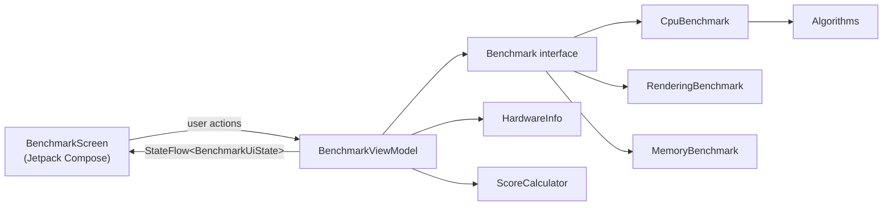

# Android Benchmark App


An Android application that measures device performance through CPU, rendering and memory/storage workloads, combines the results into a normalized score, and displays detailed hardware information.

Originally developed as a university project (2024) and later refactored to follow modern Android practices: MVVM, Kotlin coroutines, reproducible workloads and unit-tested core logic.

## Table of Contents

- [Features](#features)
- [Benchmarks](#benchmarks)
- [Scoring](#scoring)
- [Tech Stack](#tech-stack)
- [Architecture](#architecture)
- [Project Structure](#project-structure)
- [Getting Started](#getting-started)
- [Testing](#testing)
- [Design Diagrams](#design-diagrams)
- [Known Limitations](#known-limitations)
- [Roadmap](#roadmap)
- [License](#license)
- [Author](#author)

## Features

- **Three benchmark categories**: CPU, software rendering, and memory & storage. Run them individually or all at once.
- **Normalized scoring**: a score for each category plus an overall score, where higher is better.
- **Reproducible workloads**: inputs are generated with a fixed seed and prepared before timing starts, so only the measured work is timed.
- **Sequential execution on a background thread**: tests never compete with each other for CPU cores, and the UI stays responsive.
- **Hardware overview**: device, processor, RAM, storage, battery and display information, loaded automatically at startup.
- **Configuration-change safe**: state lives in a `ViewModel`, so results survive screen rotation.

## Benchmarks

| Category | Test | Workload |
|---|---|---|
| CPU | Factorial | `BigInteger` factorial of 3,000, 20 runs |
| CPU | Fibonacci | `BigInteger` Fibonacci number 10,000, 20 runs |
| CPU | Bubble sort | 5,000 random integers, 10 runs |
| CPU | Quick sort | 200,000 random integers, 10 runs |
| Rendering | Gradient fill | 30 frames at 1920×1080 into an ARGB framebuffer |
| Rendering | Mandelbrot set | 3 frames at 1280×720, up to 100 iterations per pixel |
| Memory & storage | Matrix allocation | 10 matrices of 2,000×2,000 integers |
| Memory & storage | RAM copy | 16 MB copied 20 times with `System.arraycopy` (320 MB total) |
| Memory & storage | Storage write | 8 MB written to internal storage, flushed with `fsync` |
| Memory & storage | Storage read | 8 MB read back from internal storage |

Each result shows its execution time and a description generated from the same constants the test uses, such as FPS for rendering or MB/s for memory and storage.

Implementation notes:

- Execution time is measured with `System.nanoTime()`.
- Computed values are passed to a small "blackhole" sink, so the runtime cannot treat the measured work as dead code and optimize it away.
- Quick sort uses a middle-element pivot and recurses only into the smaller partition, which keeps recursion depth at O(log n).

## Scoring

Every test has a **reference time**: the estimated execution time on a mid-range device.

```
test score     = 1000 × reference time / measured time
category score = geometric mean of the category's test scores
overall score  = geometric mean of the three category scores
```

- A device that matches the reference scores **1000**. A device twice as fast scores **2000**.
- The geometric mean is the standard way to combine benchmark ratios. A 2× speedup on any single test changes the result by the same factor.
- Each category weighs the same in the overall score, regardless of how many tests it contains.
- Hardware information is shown for context only and does not affect the score.

## Tech Stack

| Area | Technology |
|---|---|
| Language | Kotlin 2.0 |
| UI | Jetpack Compose, Material 3 (with dynamic color on Android 12+) |
| Architecture | MVVM: `AndroidViewModel` + `StateFlow` |
| Concurrency | Kotlin Coroutines (`Dispatchers.Default` for benchmarks, `Dispatchers.IO` for hardware info) |
| Build | Gradle Kotlin DSL, version catalog, Android Gradle Plugin 8.8 |
| Testing | JUnit 4 |
| Android SDK | min 21 (Android 5.0), target 35 |

## Architecture



- **UI layer**: `BenchmarkScreen` is a stateless composable. It renders `BenchmarkUiState` and forwards user actions to the ViewModel.
- **ViewModel**: `BenchmarkViewModel` owns the UI state, runs categories sequentially on a background dispatcher, prevents overlapping runs and reports failures to the UI.
- **Benchmarks**: each category implements the `Benchmark` interface and returns a list of `TestResult` objects. The algorithms live in a separate `Algorithms` object, so they can be unit tested without Android dependencies.
- **Scoring**: `ScoreCalculator` is a pure Kotlin object that turns execution times into scores.

## Project Structure

```
app/src/main/java/io/github/tavim26/benchmark/
├── MainActivity.kt                 # Entry point, sets up the theme and scaffold
├── benchmarks/
│   ├── Benchmark.kt                # Benchmark interface and timing helpers
│   ├── Algorithms.kt               # Factorial, Fibonacci, bubble sort, quick sort
│   ├── CpuBenchmark.kt
│   ├── RenderingBenchmark.kt
│   ├── MemoryBenchmark.kt
│   └── HardwareInfo.kt             # Device information (not scored)
├── model/
│   └── BenchmarkModels.kt          # Category, BenchmarkTest, TestResult
├── score/
│   └── ScoreCalculator.kt
└── ui/
    ├── BenchmarkScreen.kt          # Compose UI
    ├── BenchmarkViewModel.kt       # UI state and benchmark orchestration
    └── theme/                      # Material 3 theme

app/src/test/java/io/github/tavim26/benchmark/
├── benchmarks/AlgorithmsTest.kt
└── score/ScoreCalculatorTest.kt
```

## Getting Started

### Prerequisites

- A recent version of Android Studio, or the Android SDK command-line tools
- JDK 17
- An Android device or emulator running Android 5.0 (API 21) or newer

### Build and run

```bash
git clone https://github.com/tavim26/android-benchmark-app.git
cd android-benchmark-app

# Build a debug APK
./gradlew assembleDebug

# Install it on a connected device or a running emulator
./gradlew installDebug
```

The APK is generated at `app/build/outputs/apk/debug/app-debug.apk`. You can also open the project in Android Studio and press **Run**.

> For meaningful results, run the benchmarks on a physical device with the screen on and no other apps in the foreground. Emulator results depend heavily on the host machine.

## Testing

Unit tests cover the algorithm implementations and the scoring logic:

```bash
./gradlew testDebugUnitTest
```

- **`AlgorithmsTest`**: known factorial and Fibonacci values (including values beyond the `Long` range), and sorting of random, sorted, reversed, duplicate, empty and single-element arrays.
- **`ScoreCalculatorTest`**: reference-time scoring, geometric mean aggregation, equal category weighting and edge cases (empty input, zero execution time).

## Design Diagrams

The application was modeled in UML before implementation. The diagrams show the **original design**; the code has since been refactored (see [Architecture](#architecture) for the current structure).

<p align="center">
  
</p>

- [Use case diagram](diagrams/usecase_diagram.png)
- [Package diagram](diagrams/package_diagram.png)
- Module diagrams: [CPU](diagrams/cpu.png) · [GPU](diagrams/gpu.png) · [Memory](diagrams/memory.png) · [Hardware](diagrams/hardware.png)

## Known Limitations

- **The rendering benchmark runs on the CPU.** It measures software rendering into a framebuffer, not GPU performance. A true GPU benchmark would require OpenGL ES or Vulkan.
- **Reference times are estimates.** They were not calibrated on a specific device, so "1000 points" does not correspond to a particular phone model. Scores remain valid for comparing devices with each other.
- **The storage read test may be served from the OS page cache**, which can report higher throughput than the physical storage provides.
- **No warm-up runs.** The first execution may include JIT compilation overhead, and long runs may be affected by thermal throttling.
- **The workloads are single-threaded**, so multi-core performance is not measured.
- **Results are not persisted.** They are kept in memory for the current session only.

## Roadmap

- [ ] GPU benchmark based on OpenGL ES
- [ ] Multi-core CPU benchmark
- [ ] Warm-up iterations, with the median of several runs reported
- [ ] Reference times calibrated on a real device
- [ ] Result history and export
- [ ] Continuous integration with GitHub Actions
- [ ] Instrumented UI tests

## License

Distributed under the MIT License. See [`LICENSE`](LICENSE) for details.
