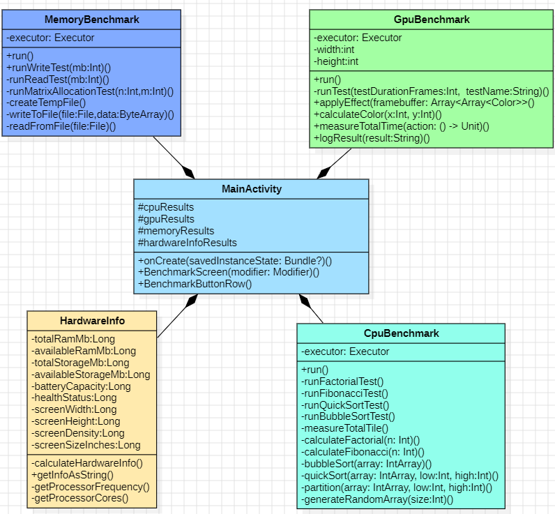

# Android Benchmark App


An Android application that measures device performance through a set of CPU, rendering and memory workloads, and reports detailed hardware information. Built with Kotlin and Jetpack Compose as a university project (2024).


## Features

- **CPU benchmark**: four algorithmic workloads executed on a background thread pool
- **Rendering benchmark**: software rendering of full-HD frames into an in-memory framebuffer
- **Memory benchmark**: file write/read throughput and large matrix allocation
- **Hardware overview**: device model, CPU, RAM, storage, battery and display details
- **Persistent results**: every run is appended to text files in the app's internal storage
- **Overall score**: aggregated once all benchmarks have finished (see [Known limitations](#known-limitations))

## Benchmarks

| Module | Workload | Parameters |
|---|---|---|
| CPU | Factorial | n = 1000, 10 iterations |
| CPU | Fibonacci (iterative) | n = 1000, 10 iterations |
| CPU | Bubble sort | 50,000 random integers, 10 iterations |
| CPU | Quick sort | random integer array, 10 iterations |
| Rendering | Per-pixel color computation on a 1920×1080 framebuffer | 4 tests: 5, 10, 15 and 20 frames |
| Memory | File write | 1 MB of random data |
| Memory | File write + read | 1 MB of random data |
| Memory | Matrix allocation | 10 matrices of 2000×2000 integers |

Each module runs its workloads concurrently on a fixed-size `ExecutorService`, so the UI thread stays responsive while the tests execute. Execution time is measured with `measureTimeMillis`.

### Hardware information collected

- Device model, manufacturer, brand and Android version (API level)
- Supported CPU ABIs, number of cores and maximum CPU frequency
- Total and available RAM (`ActivityManager.MemoryInfo`)
- Total and available internal storage (`StatFs`)
- Battery level and health (`BatteryManager`)
- Screen resolution, density and physical size

## Tech stack

- **Language:** Kotlin 2.0
- **UI:** Jetpack Compose, Material 3
- **Concurrency:** `java.util.concurrent.Executors`
- **Build:** Gradle (Kotlin DSL) with a version catalog, Android Gradle Plugin 8.8
- **SDK:** min 21 (Android 5.0), target 35

## Architecture

```
app/src/main/java/com/example/mobilebenchmarkapp/
├── main/
│   └── MainActivity.kt        # Compose UI, result state and score aggregation
├── benchmarks/
│   ├── CpuBenchmark.kt        # Algorithmic CPU workloads
│   ├── GpuBenchmark.kt        # Software framebuffer rendering
│   ├── MemoryBenchmark.kt     # File I/O and allocation tests
│   └── HardwareInfo.kt        # Device and system information
└── ui/theme/                  # Material 3 theme, colors and typography
```

Each benchmark class receives a `Context` and an `onResult` callback. It runs its tests in the background, reports every result through the callback and appends it to a results file.

The design was modeled in UML before implementation. The diagrams are in [`diagrams/`](diagrams/) (StarUML source: `Diagrams.mdj`):

<p align="center">
  
</p>

- [Use case diagram](diagrams/usecase.png)
- [Package diagram](diagrams/pachete.png)
- [UI diagram](diagrams/ui.png)
- Module diagrams: [CPU](diagrams/cpu.png) · [GPU](diagrams/gpu.png) · [Memory](diagrams/memory.png) · [Hardware](diagrams/hardware.png)

## Getting started

### Requirements

- A recent version of Android Studio
- JDK 17 (required by Android Gradle Plugin 8.x)
- An Android device or emulator running Android 5.0 (API 21) or newer

### Build and run

```bash
git clone https://github.com/tavim26/android-benchmark-app.git
cd android-benchmark-app

# Build a debug APK
./gradlew assembleDebug

# Install on a connected device or running emulator
./gradlew installDebug
```

The APK is generated at `app/build/outputs/apk/debug/app-debug.apk`. You can also open the project in Android Studio and press **Run**.

> For meaningful results, run the benchmarks on a physical device. Emulator performance depends heavily on the host machine.

## Known limitations

This project was built as a learning exercise, and a few parts are intentionally simplified:

- **The "GPU" benchmark runs on the CPU.** It simulates rendering in software and mostly measures object allocation and garbage collection. A true GPU benchmark would use OpenGL ES or Vulkan.
- **The overall score is not a reliable metric.** It is derived heuristically from the numbers in the result text, rather than from normalized execution times.
- **The memory read/write tests measure storage I/O,** not RAM bandwidth, and random data generation is included in the timed section.
- **Tests within a module run concurrently,** so they compete for CPU cores, which affects individual timings.
- Results are not reset between runs: the result files keep growing.

## Planned improvements

- [ ] Move benchmark logic into a `ViewModel` using Kotlin coroutines
- [ ] Replace the score heuristic with a score based on normalized execution times
- [ ] Implement a real GPU benchmark with OpenGL ES
- [ ] Separate RAM benchmarks from storage I/O benchmarks
- [ ] Add unit tests for the algorithms and the scoring logic
- [ ] Add a CI workflow (GitHub Actions) that builds the project on every push

## License

Distributed under the MIT License. See [`LICENSE`](LICENSE) for details.

## Author

**Octavian Mirisan**, [GitHub @tavim26](https://github.com/tavim26)
